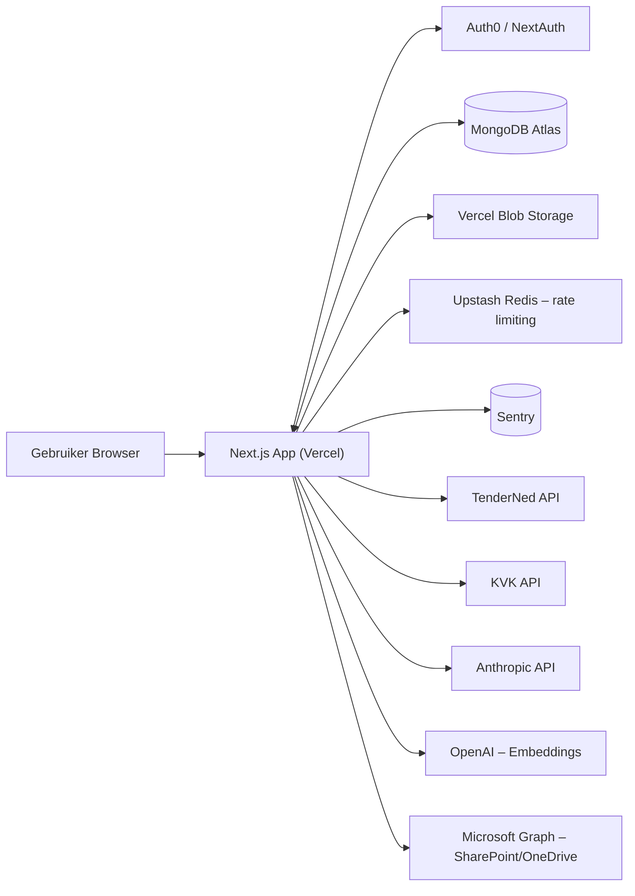
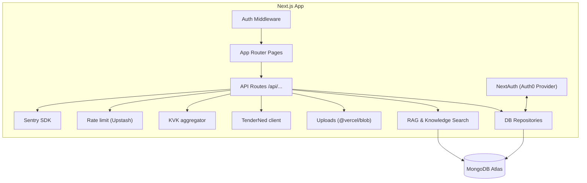
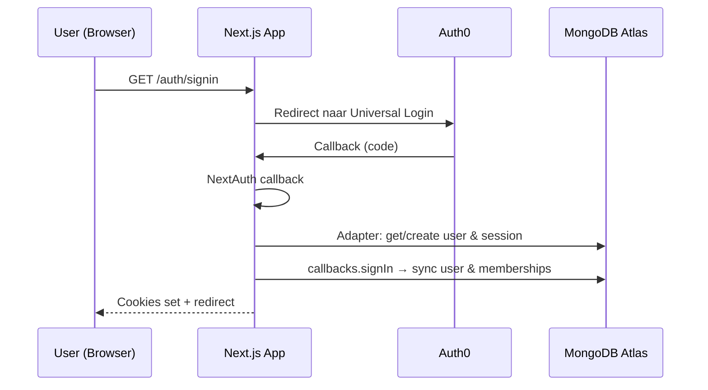
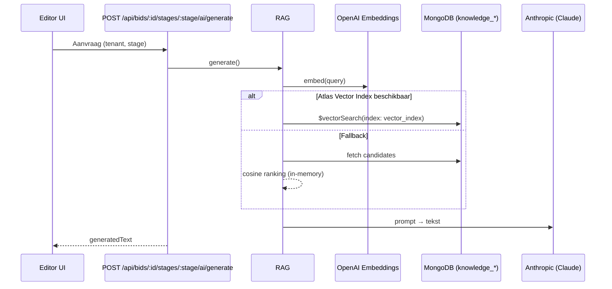
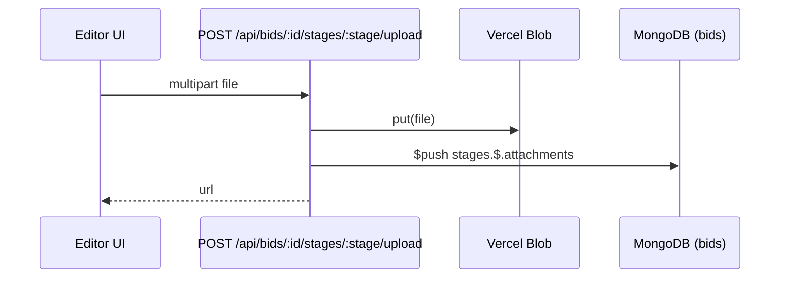
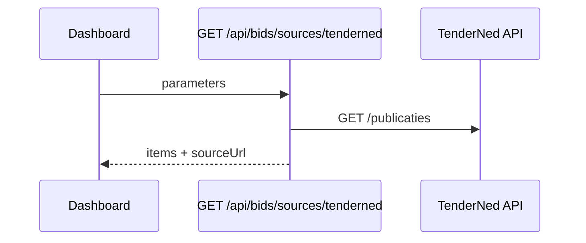
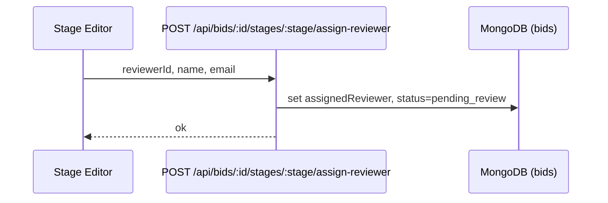

# Appalti – Platform Architecture (Mermaid Diagrams)

> Deze pagina bevat aanpasbare Mermaid‑diagrammen. Je kunt ze bewerken in deze file of op mermaid.live en terugplakken. GitHub rendert Mermaid automatisch.

## 1) System Context (Overzicht)

## 2) Container View (Binnen de Next.js app)

## 3) Sequence – Login/Registratie (Auth0 → NextAuth → MongoDB)

## 4) Sequence – RAG Generate (Editor)

## 5) Sequence – Upload bijlage

## 6) Sequence – TenderNed lijst/detail

## 7) Sequence – Reviewer toewijzen

---

### Aanpassen/uitbreiden
- Bewerk de Mermaid‑blokken in deze file direct.
- Of gebruik de online editor: https://mermaid.live → plak het blok → exporteer SVG/PNG.
- Extra ideetjes: voeg C4‑achtige subdiagrammen toe voor Auth, Bids, Knowledge.