# Appalti – End‑to‑End Platform Flow (A2/A3)

> Doel: één document om als A2/A3 poster te renderen. Elke box heeft een korte, begrijpelijke alias tussen haakjes.
> Tip: kopieer blokken naar https://mermaid.live voor export naar PNG/SVG.

## 0) Legenda (begrijpelijke aliases)
- Next.js App (Webapp): frontend + backend routes op Vercel
- Auth0 (Login dienst): identiteitsprovider
- NextAuth (Sessies): sessies in onze app
- MongoDB Atlas (Database): app‑data en vector data
- Vercel Blob (Bestanden): geüploade documenten
- Upstash Redis (Snelheidsrem): rate limiting
- Sentry (Storingsmonitor): foutmonitoring
- TenderNed API (Aankondigingen): aanbestedingen feed
- KVK API (Bedrijfsprofielen): bedrijfsgegevens
- Anthropic (AI schrijver): genereren/reviewen
- OpenAI (Zoek‑vingerafdruk): embeddings
- Microsoft Graph (SharePoint/OneDrive): documentenbron

## 1) Big Picture – alles samen
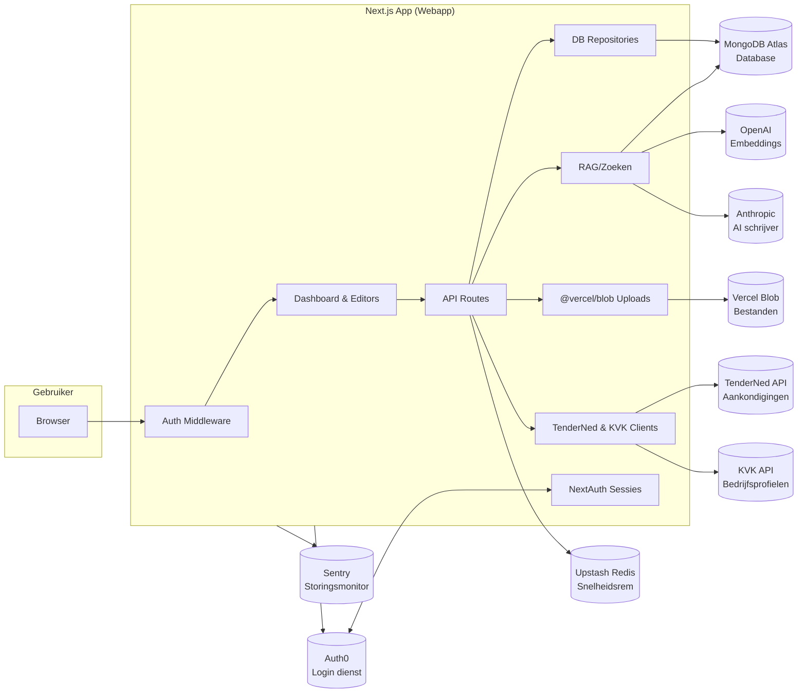

## 2) Inloggen en Registreren – volledige routekeuze
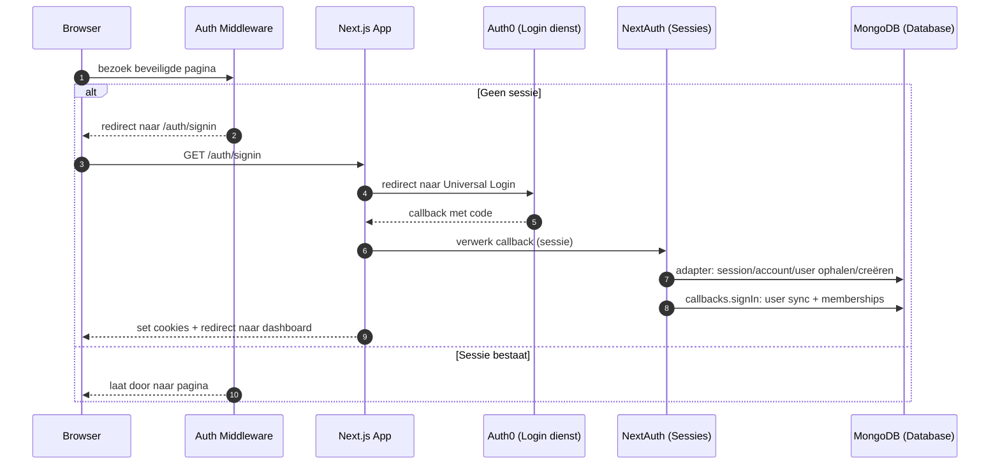

## 3) Tenant context (Appalti vs Client)
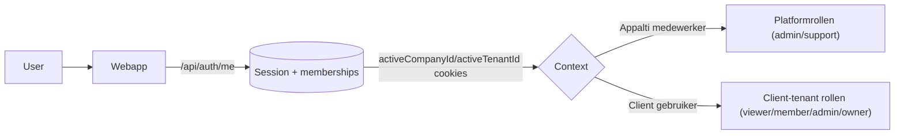

## 4) Client Companies & Team (Enterprise)
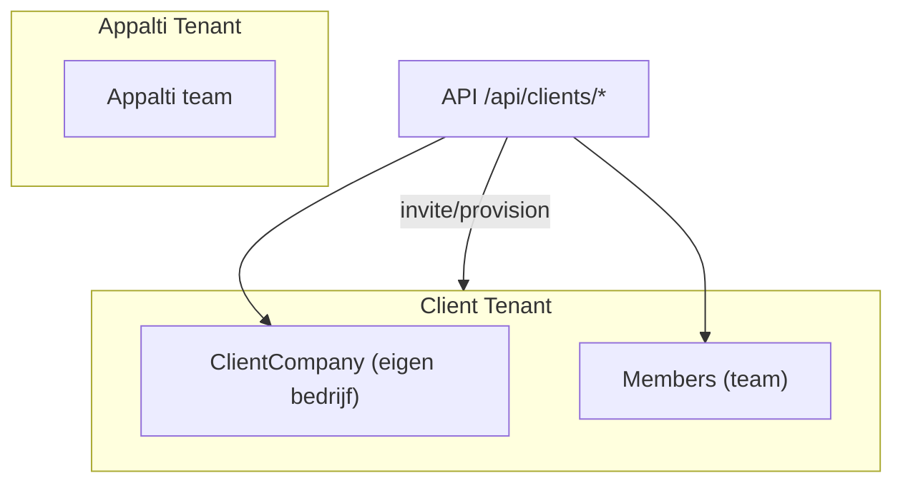

## 5) Tender koppelen en Bid‑proces
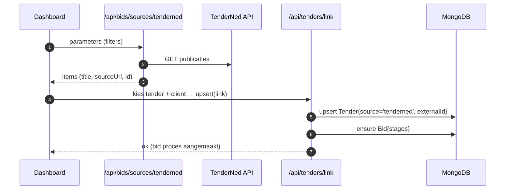

## 6) Editor – AI genereren en review (RAG)
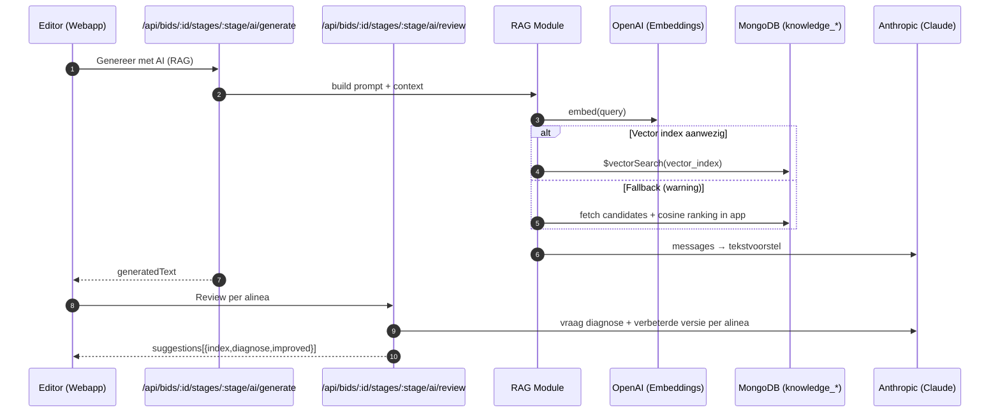

## 7) Uploads (bijlagen) en bronnen
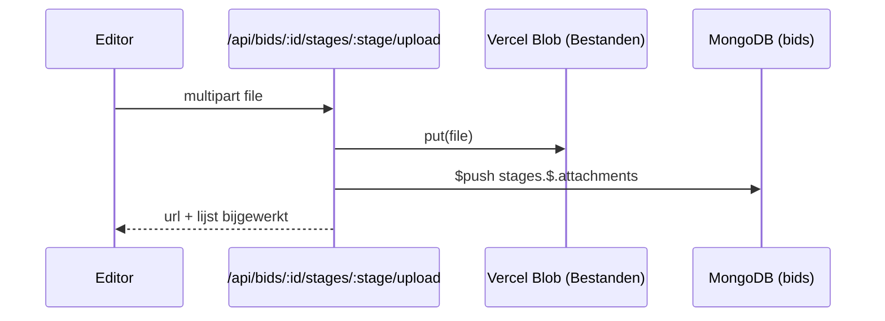

## 8) KVK (Bedrijfsprofielen)
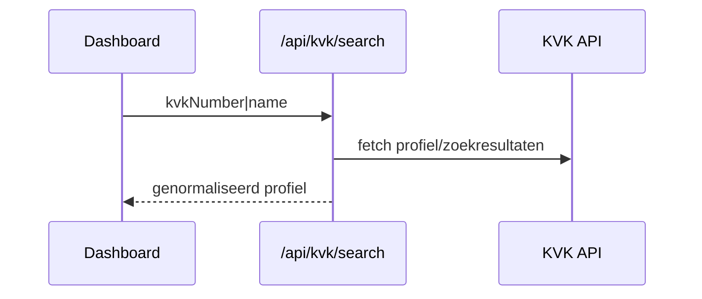

## 9) Reviewer toewijzen en status
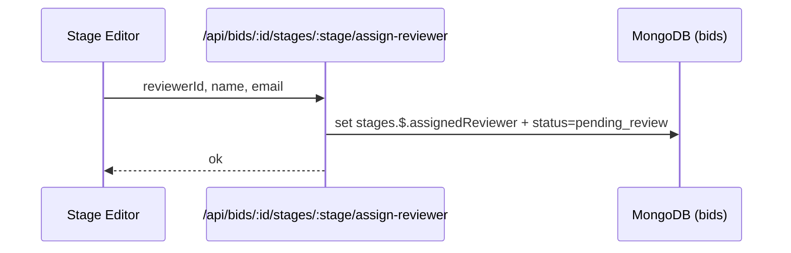

## 10) Datalaag (wat staat waar?)
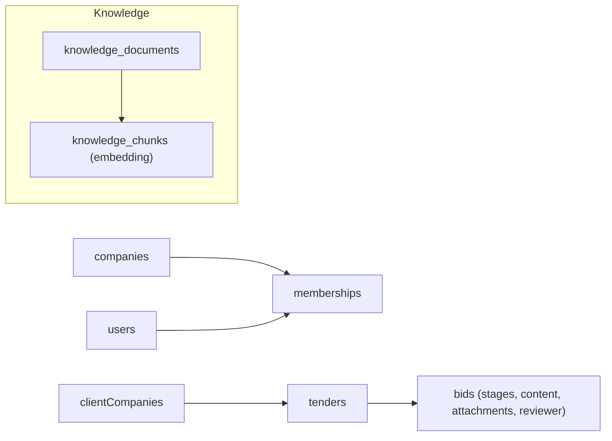

## 11) Toekomst – horizontale bibliotheek (historie)
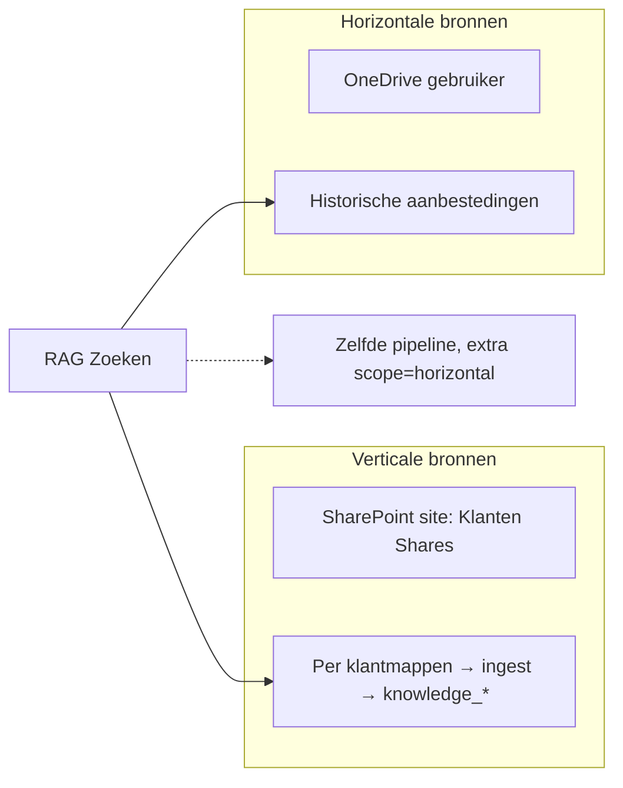

---

### Hoe genereren naar poster
- Open dit bestand op GitHub → “Raw” → kopieer gewenste blok(ken) → mermaid.live → stel “A2” in → exporteer als PNG/SVG.
- Tip: maak desnoods per sectie aparte pagina’s (LOGIN, RAG, UPLOADS) voor maximale leesbaarheid op A2.